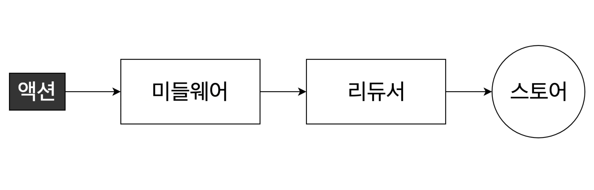

# Middleware(미들웨어)

리덕스의 가장 강력한 기능이라고 볼 수 있으며 액션에서 리듀서로 가기 전 미들웨어를 거쳐 다양한 처리가 가능하게 해줍니다.

위 그림처럼 액션과 리듀서 중간에 위치하여 여러가지 처리를 하게 됩니다.

1. 액션이 특정 조건에 따라 무시 처리
2. 액션이 리듀서에게 전달 되기 전에 특정 코드를 실행
3. 리덕스에 관련된 작업이 아닌 것도 실행이 가능
4. 비동기 작업을 처리

여러가지 작업들 중에서 가장 많이 사용되는 용도는 바로 `비동기 작업`입니다. 
미들웨어 또한 여러 종류가 있습니다.

- redux-thunk
- redux-saga
- redux-observable
- redux-promise-middleware

목적은 같지만 각각의 특성이 다 다릅니다.

## 미들웨어 설치하기
