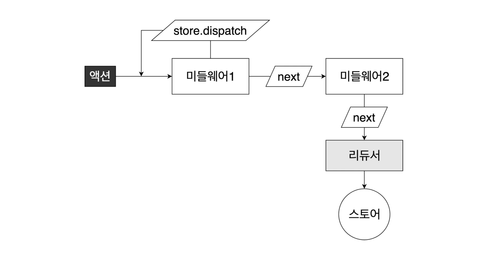

# Middleware(미들웨어)

리덕스의 가장 강력한 기능이라고 볼 수 있으며 액션에서 리듀서로 가기 전 미들웨어를 거쳐 다양한 처리가 가능하게 해줍니다.


위 그림처럼 액션과 리듀서 중간에 위치하여 여러가지 처리를 하게 됩니다.

1. 액션이 특정 조건에 따라 무시 처리
2. 액션이 리듀서에게 전달 되기 전에 특정 코드를 실행
3. 리덕스에 관련된 작업이 아닌 것도 실행이 가능
4. 비동기 작업을 처리

여러가지 작업들 중에서 가장 많이 사용되는 용도는 바로 `비동기 작업`입니다.<br/>
미들웨어 또한 여러 종류가 있습니다.

- redux-thunk
- redux-saga
- redux-observable
- redux-promise-middleware

목적은 같지만 각각의 특성이 다 다릅니다.

## 미들웨어 구동방식

```js
function middleware(store) {
  return function (next) {
    return function (action) {
      // do something...
    };
  };
}
```

```js
const middleware = (store) => (next) => (action) {
    // do something...
}
```

store는 next 함수를 반환하고, next는 action 객체를 반환합니다.<br/>
여기서 next의 역할은 무엇일까요?



미들웨어는 하나 이상을 가질 수 있습니다. 그래서 `next 함수`는 미들웨어를 건너거나 리듀서에게 최종적으로 건네주는 역할을 수행합니다.<br/>
즉, 특정 액션을 수행하지 않게 하려면 액션을 next하지 못하게 조치하면 리듀서를 통과하지 않는 것입니다.

## 미들웨어 구현하기

### myLogger.js

```js
const myLogger = (store) => (next) => (action) => {
  console.log(action);
  console.log("\tPREV: ", store.getState());
  const result = next(action);
  console.log("\tNEXT: ", store.getState());
  return result; // 컨테이너에서 액션을 반환하는 함수의 값
};

export default myLogger;
```

next는 액션을 취한 후의 결과를 담아줍니다. 건넨 후의 state는 액션이 실행된 이후의 값을 나타냅니다.

### index.js

```js
import React from "react";
import ReactDOM from "react-dom";
import "./index.css";
import App from "./App";
import * as serviceWorker from "./serviceWorker";
import { Provider } from "react-redux";
import { createStore, applyMiddleware } from "redux";
import rootReducer from "./modules";
import myLogger from "./middlewares/myLogger";

const store = createStore(rootReducer, applyMiddleware(myLogger));

ReactDOM.render(
  <React.StrictMode>
    <Provider store={store}>
      <App />
    </Provider>
  </React.StrictMode>,
  document.getElementById("root")
);

// If you want your app to work offline and load faster, you can change
// unregister() to register() below. Note this comes with some pitfalls.
// Learn more about service workers: https://bit.ly/CRA-PWA
serviceWorker.unregister();
```

applyMiddleware를 redux에서 가져온 후 store에서 만든 미들웨어를 파라미터에 넣어주면 됩니다.
