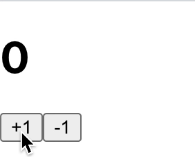

# Redux-saga

리덕스 사가는 액션을 모니터링하다가 `특정 액션`이 발생하면 `특정 작업`을 하는 방식입니다.<br />
자바스크립트의 Generator 문법을 사용합니다.

## Redux-saga로 처리할 수 있는 것

1. 비동기 작업을 진행 할 때 기존 요청을 취소할 수 있다.
2. 특정 액션이 발생 헀을 때 이에 따라 다른 액션을 디스패치 하거나 자바스크립트 코드를 실행할 수 있다.
3. 웹 소켓을 사용하는 경우 Channel 이라는 기능을 사용하여 더욱 효율적으로 코드를 관리할 수 있다.
4. 비동기 작업이 실패했을 때 재시도 하는 기능을 구현 할 수 있다.

## Generator

함수의 흐름을 특정 구간에 멈춰놓았다가 **다시 실행**할 수 있으며, 결과값을 **여러번 내보낼** 수 있습니다.

```js
function weirdFuntion() {
  return 1;
  return 2;
  return 3;
  return 4;
}
```

weirdFuntion 함수는 언제 어디서 호출하던 상관없이 항상 1을 반환합니다.

```js
function* generatorFunction() {
  console.log("안녕하세요");
  yield 1;
  console.log("제네레이터 함수");
  yield 2;
  console.log("function*");
  yield 3;
  return 4;
}

const generator = generatorFunction(); // suspended 상태
generator.next(); // {value: 1, done: false} 안녕하세요
generator.next(); // {value: 2, done: false} 제네레이터 함수
generator.next(); // {value: 3, done: false} function*
generator.next(); // {value: 4, done: true} closed 상태
generator.next(); // {value: undefined, done: true} closed 상태
```

하지만 Generator를 사용하면 상황에 따라 다른 yield값을 value에 저장합니다. 만약 최종 값이라면 done을 true로 변경해 리턴합니다.<br />
즉 yield를 사용해서 함수를 멈춘 후 `next`가 호출 되면 다름 로직을 수행합니다.

## Redux-saga 설치하기

```bash
yarn add redux-saga
```

## Redux-saga 사용하기

### counter.js

```js
import { delay, put, takeEvery, takeLatest } from "redux-saga/effects";

// 액션 타입
const INCREASE = "INCREASE";
const DECREASE = "DECREASE";
const INCREASE_ASYNC = "INCREASE_ASYNC";
const DECREASE_ASYNC = "DECREASE_ASYNC";

// 액션 생성 함수
export const increase = () => ({
  type: INCREASE,
});
export const decrease = () => ({
  type: DECREASE,
});
export const increaseAsync = () => ({
  type: INCREASE_ASYNC,
});
export const decreaseAsync = () => ({
  type: DECREASE_ASYNC,
});

function* increaseSaga() {
  yield delay(1000);
  yield put(increase());
}

function* decreaseSaga() {
  yield delay(1000);
  yield put(decrease());
}

export function* counterSaga() {
  yield takeEvery(INCREASE_ASYNC, increaseSaga);
  yield takeLatest(DECREASE_ASYNC, decreaseSaga);
}

// 초기 데이터
const initialState = 0;

// 리듀서
export default function counter(state = initialState, action) {
  switch (action.type) {
    case INCREASE:
      return state + 1;
    case DECREASE:
      return state - 1;
    default:
      return state;
  }
}
```

delay와 put은 redux-saga의 effects 내부에 있는데 이는 작업을 명령하는 역할을 합니다.<br />
delay는 지연, put은 dispatch 역할, takeEvery는 특정 액션 수행시, takeLatest는 맨 마지막 액션만 해당 제네레이터 함수를 실행하는 역할을 수행합니다.<br />
INCREASE_ASYNC 할 때 increaseSaga 제네레이터를 실행합니다.

## 모듈

```js
import { combineReducers } from "redux";
import counter, { counterSaga } from "./counter";
import posts from "./posts";
import { all } from "redux-saga/effects";

const rootReducer = combineReducers({
  counter,
  posts,
});

export function* rootSaga() {
  yield all([counterSaga()]);
}

export default rootReducer;
```

all을 가져와 rootSaga 함수에 만든 함수를 불러옵니다.

## index.js

```js
import React from "react";
import ReactDOM from "react-dom";
import "./index.css";
import App from "./App";
import * as serviceWorker from "./serviceWorker";
import { Provider } from "react-redux";
import { createStore, applyMiddleware } from "redux";
import rootReducer, { rootSaga } from "./modules";
import { composeWithDevTools } from "redux-devtools-extension";
import logger from "redux-logger";
import ReduxThunk from "redux-thunk";
import { Router } from "react-router-dom";
import { createBrowserHistory } from "history";
import createSagaMiddleware from "redux-saga";

const customHistory = createBrowserHistory();
const sagaMiddleware = createSagaMiddleware();

const store = createStore(
  rootReducer,
  composeWithDevTools(
    applyMiddleware(
      ReduxThunk.withExtraArgument({ history: customHistory }),
      sagaMiddleware,
      logger
    )
  )
);

sagaMiddleware.run(rootSaga);

ReactDOM.render(
  <React.StrictMode>
    <Router history={customHistory}>
      <Provider store={store}>
        <App />
      </Provider>
    </Router>
  </React.StrictMode>,
  document.getElementById("root")
);

serviceWorker.unregister();
```

createSagaMiddleware로 Saga 미들웨어를 만든 후 스토어에 미들웨어를 적용시킨 후, run에 보낸 함수를 담아줍니다.


